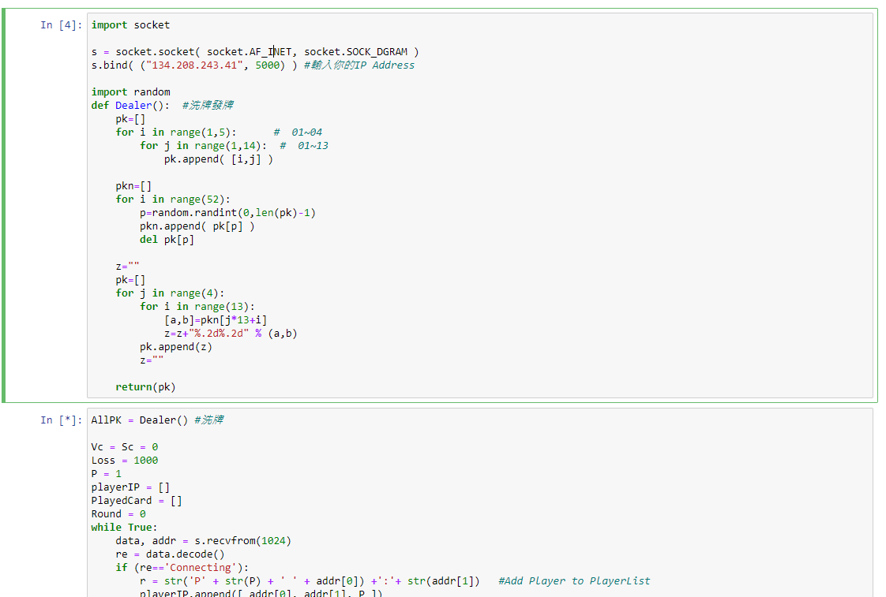
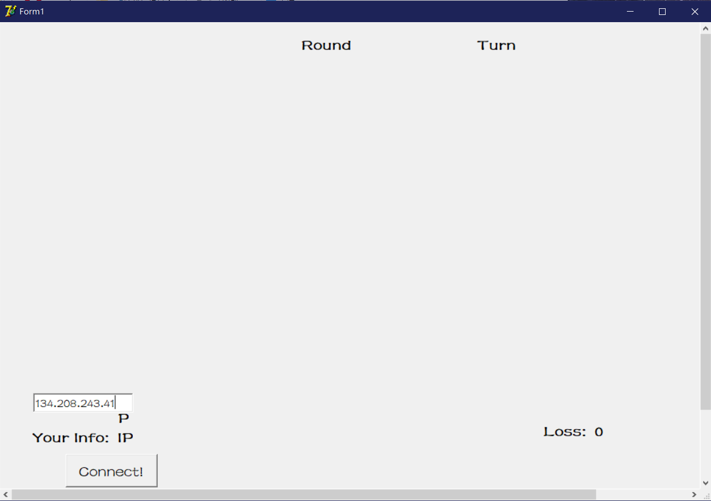
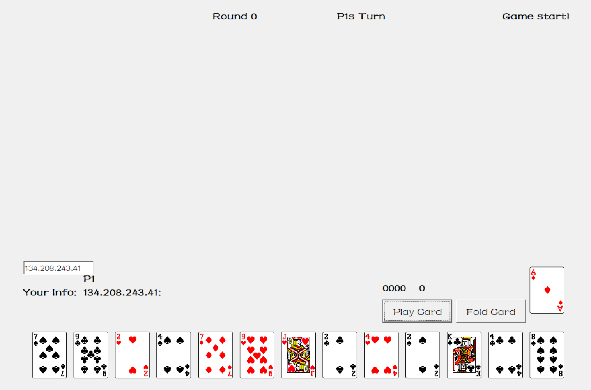
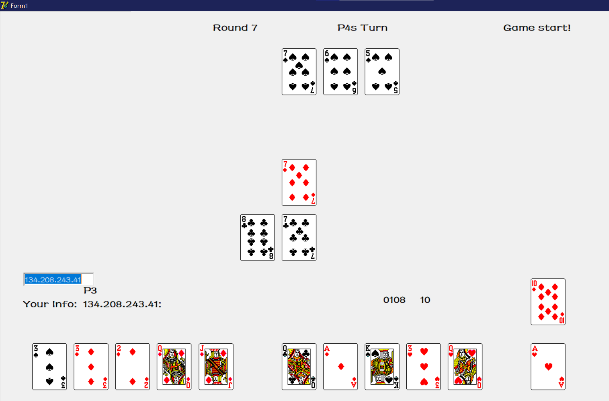

# Delphi_Laying-Out-Sevens
A funny Card game

## Description:

**Step 1:** Open "OpenServer" and change **ip** to the ip address of your own computer.

**Step 2:** Open "PlayGame!" to open the game window, and change "Server IP" to the ip address of the server.

**Step 3:** Waiting for all your friends to connect.

**Step 4:** Have fun~

